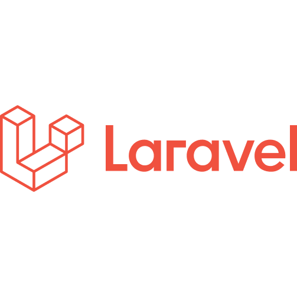
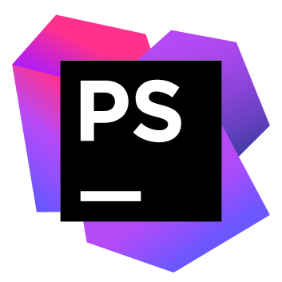

<p align="center">
    </img>
</p>

---
<code>my profile :) </code>


```PHP
$name = 'Amirhossien-Imanpur';
$age = '<=18';
$location = (Iran - Tabriz );
exit();
```
##  __skills__
<p>
    </img>
    </img>
    </br>
    </img>
    </img>
</p>

## app using

<p>
    </img>
    </img>
    </br>
    </br>
     </img>

</p>

------
## my __activity__


